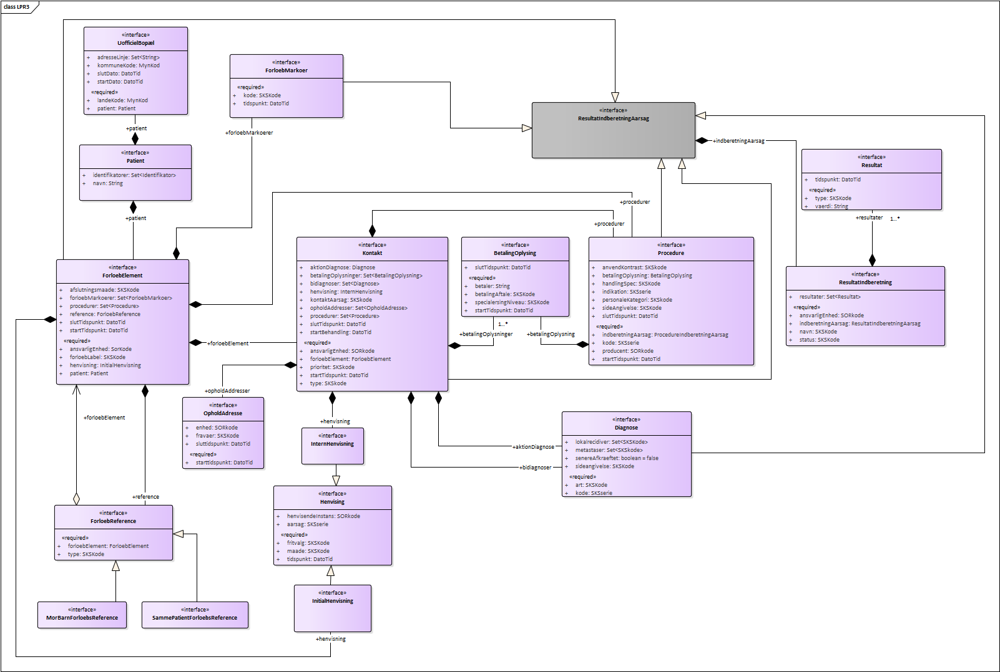

# Interface aspects and usage

## The document paradigm and CDA R2
LPR3 is based on a profiled version CDA R2 according to the needs of the LPR3 data model. The reported documents can be considered as containers of information that are bound to a single patient. Each document can contain zero to many elements, where elements can e.g. be episode of care, encounter, procedure, observation and act. The elements are arranged into sections according to CDA R2. Each element shall be marked up with the appropriate templateId in order to be evaluated and stored as part of LPR3. While elements that are not marked up with the corresponding templateId's according to the LPR3 CDA specification are permitted, they are not evaluated and as such should be avoided.

## What documents can be submitted
LPR3 supports two kinds of reporting:

- Full state reporting
- Partial reporting

Full state reporting concerns the case where the client system reports an entire document covering a set of selected services and treatments chosen by the client where the state of eventual previous reported documents with the same document ID is completely overwritten.

Partial state reporting concerns the case where the client system reports a document covering a set of selected services and treatments chosen by the client where the state of an eventual previous reported document is updated. The items that are to be updated are explicitly stated within the newly reported document. Within the newly reported document items can be nullified, items can be updated or items can be added.

## Documents and versioning
All reported documents (initial state and corrections) must be versioned using ClinicalDocument.id, ClinicalDocument.setId and ClinicalDocument.versionNumber. Initial versionNumber MUST be '1'. Whenever the document is appended to or replaced (collectively known as *update*), the ClinicalDocument.versionNumber must be incremented and the ClinicalDocument.id must unique. ClinicalDocument.setId must remain the same across all versions.

Note: *Replace* will replace all previous documents and addendums.

This stated use of id, setId and versionNumber ensures that no updates to documents are appended in the wrong order - a refinement of what is stated in sections 4.2.1.7, 4.2.1.8 and 4.2.3.1 - *"Note that version number must be incremented by one when a report is replaced, but can also be incremented more often to meet local requirements."* - [CDA R2](http://www.hl7.org/implement/standards/product_brief.cfm?product_id=7).


## Rules for updating documents
  * First submitted document constitutes the ‘base document set’.
  * Update of entries and/or nullifying entries in the ‘base document set’ are contained within 'addendum documents' to the 'base document set'.
  * Submitted 'addendum document's becomes part of the ‘base document set’. 
  * Multiple ‘addendum document’s  are allowed. An ‘addendum document’ can contain multiple updated entries and/or nullified entries that points towards entries in previously submitted ‘addendum document’s or entries part of the ‘base document set’.
  * Once an entry is nullified, it is permanently removed.
  * Replacements can be done on ‘base document set’ level. If a document with typeCode ‘RPLC’ submitted, all previously received addendums are removed as well as the ‘base document set’. The replacing document is then the new ‘base document set’.

## What rules apply and what errors can be reported and how
All documents submitted to LPR3 are validated at the following levels:

 1. Execute schema validation (`XSD`) according to CDA R2 standard
 2. Execute schematron validation (`SHCEMATRON`) according to the profile specificed at the ART-DECOR site
 3. Execute data coherency/conformity validation (`INTEGRITY_CHECK`)
 4. Execute drools validation rules AKA business rules (`BUSINESS_RULE`)


Errors in submitted documents can be found at any of the levels stated above. If a document fails to meet level 1, 2, or 3, no further processing will be conducted and a report will be returned stating the errors in <b>ebXML</b>-format as used in IHE XDR. 
If errors are found at level 4, the continued processing is dependent on the endpoint called (see [service endpoint setup](https://scandihealth.github.io/lpr3-docs/aspects/index.html#service-endpoint-setup)) 

While level 1 is static and level 2 & level 3 should be considered static (variance can occur in valuesets depending on the business needs), 
level 4 is considered dynamic in that sense that business rules are subject to change or be deprecated over time. Level 4 is referred to as <b>"Dyb validering"</b> in the reporting guidelines supplied by <b>Sundhedsdatastyrelsen</b>.

Level 1, 2, and 4 rules are exportable in the formats XSD, Schematron, and KIE jar (kjar) files, respectively. 
The XSD and Schematron files does not include LPR3 assigned error codes - instead, when executed on a document, the XSD and Schematron reported errors will point out exactly where in the document the errors are and what has been violated. 

Below XML illustrates how the errors at different leves are wrapped in a `RegistryResponse` according to IHE XDR/XDS ebXml:
~~~xml
<rs:RegistryResponse
	status="urn:oasis:names:tc:ebxml-regrep:ResponseStatusType:Failure">
	<rs:RegistryErrorList
		highestSeverity="urn:oasis:names:tc:ebxml-regrep:ErrorSeverityType:Error">
		<rs:RegistryError
			codeContext="XSD|||cvc-complex-type.2.4.a: Invalid content was found starting with element 'assignedAthor'. One of '{&amp;quot;urn:hl7-org:v3&amp;quot;:assignedAuthor}' is expected."
			errorCode="InvalidDocumentContent" 
			location="2189b2c3-fa2d-4d8e-9af4-995893b12b39^54abd790-8a4c-4a1d-b41c-8d8749f6913c|||48:23"
			severity="urn:oasis:names:tc:ebxml-regrep:ErrorSeverityType:Error" />
		<rs:RegistryError
			codeContext="SCHEMATRON|||(DKSpecializationLevelAct): The value for code SHALL be selected from value set '1.2.208.176.2.4.18' DK Specialization Level Act Codes (DYNAMIC)."
			errorCode="InvalidDocumentContent"
			location="2189b2c3-fa2d-4d8e-9af4-995893b12b39^54abd790-8a4c-4a1d-b41c-8d8749f6913c|||/*:ClinicalDocument[namespace-uri()='urn:hl7-org:v3'][1]/*:component[namespace-uri()='urn:hl7-org:v3'][1]/*:structuredBody[namespace-uri()='urn:hl7-org:v3'][1]/*:component[namespace-uri()='urn:hl7-org:v3'][4]/*:section[namespace-uri()='urn:hl7-org:v3'][1]/*:entry[namespace-uri()='urn:hl7-org:v3'][1]/*:encounter[namespace-uri()='urn:hl7-org:v3'][1]/*:entryRelationship[namespace-uri()='urn:hl7-org:v3'][3]/*:act[namespace-uri()='urn:hl7-org:v3'][1]/*:entryRelationship[namespace-uri()='urn:hl7-org:v3'][1]/*:act[namespace-uri()='urn:hl7-org:v3'][1]/*:code[namespace-uri()='urn:hl7-org:v3'][1]"
			severity="urn:oasis:names:tc:ebxml-regrep:ErrorSeverityType:Error"/>
        <rs:RegistryError
            codeContext="INTEGRITY_CHECK|||Set with id 2252b2c3-fa2d-4d8e-9af4-995893b12b39 already exists in the registry, and ClinicalDocument does not contain a relatedDocument|||SET_ALREADY_EXISTS_AND_NO_RELATED_DOCUMENT|||2252b2c3-fa2d-4d8e-9af4-995893b12b39"
            errorCode="InvalidDocumentContent"
            location="2189b2c3-fa2d-4d8e-9af4-995893b12b39^54abd790-8a4c-4a1d-b41c-8d8749f6913c|||//*[local-name()='ClinicalDocument' and child::*[local-name()='setId' and @root='2252b2c3-fa2d-4d8e-9af4-995893b12b39'] and not(child::*[local-name()='relatedDocument'])]"
            severity="urn:oasis:names:tc:ebxml-regrep:ErrorSeverityType:Error"/>
		<rs:RegistryError
			codeContext="BUSINESS_RULE|||Hvis der til en diagnose er knyttet en kode for lokalrecidiv, skal diagnosen være en anmeldelsespligtig cancerdiagnose for primær kræft"
			errorCode="InvalidDocumentContent"
			location="2189b2c3-fa2d-4d8e-9af4-995893b12b39^54abd790-8a4c-4a1d-b41c-8d8749f6913c|||//*[child::*[local-name()='id' and @root='9827ad00-ef98-4439-bca5-9503a5b817c8' and @extension='f90b4644-8b5a-4824-972d-a6594cd05959']]|||sds:lpr:3.0.4|||14.102a"
			severity="urn:oasis:names:tc:ebxml-regrep:ErrorSeverityType:Error" />
		<rs:RegistryError
			codeContext="BUSINESS_RULE|||Bidiagnoser skal senest være indrapporteret senest 2 uger efter kontaktens slutningstidspunkt"
			errorCode="InvalidDocumentContent"
			location="2189b2c3-fa2d-4d8e-9af4-995893b12b39^54abd790-8a4c-4a1d-b41c-8d8749f6913c|||//*[child::*[local-name()='id' and @root='9827ad00-ef98-4439-bca5-9503a5b817c8' and @extension='f90b4644-8b5a-4824-972d-a6594cd05959']]|||sds:lpr:3.0.4|||00.142"
			severity="urn:oasis:names:tc:ebxml-regrep:ErrorSeverityType:Warning" />
	</rs:RegistryErrorList>
</rs:RegistryResponse>
~~~

### codeContext
The `codeContext` attribute contains information about _what_ the error is.

The attribute value is split into 2 mandatory segments and 1 conditional segment (placed in parentheses), with `|||` as segment delimiter:  
`<validation type>|||<validation text>(|||<integrity error identifier>)`. 

* `<validation type>` can be any of the following: `XSD`, `SCHEMATRON`, `INTEGRITY_CHECK`, `BUSINESS_RULE` 
* `<validation text>` contains a human readable explanation of what has been violated, in technical terms
* `<integrity error identifier>` is the conditional segment containing the unique ID of the violated integrity check and the values causing the violation on the format:  
`<integrity code>|||<param1>|||<param2|||...|||<paramN>`
    * Present only when `<validation type>` is **INTEGRITY_CHECK**
    * `<integrity code>` is a unique code for the data integrity rule that has been violated. See below for a complete list of implemented integrity rules 
    * `<param>` elements contain the variable parts of an error (e.g. which encounter that already exists). The params are included in the `<validation text>`, but are also provided as separate segments to make it easier to machine process the error
    * Example: `SET_ALREADY_EXISTS_AND_NO_RELATED_DOCUMENT|||2252b2c3-fa2d-4d8e-9af4-995893b12b39`  

### location
The `location` attribute contains information about _where_ the error is.

The value of `location` is split into 1 mandatory segment and 3 conditional segments (placed in parentheses), with `|||` as segment delimiter:  
`<document id>(|||<line:column>)(|||<xpath expression>)(|||<business rule unique identifier>)`

* `<document id>` is the DocumentEntry.uniqueId - see ["IHE IT Infrastructure (ITI TF-3) "](http://www.ihe.net/uploadedFiles/Documents/ITI/IHE_ITI_TF_Vol3.pdf) *(section 4.2.3.2.26)*
* `<line:column>` is the line and column in the CDA document where the error is detected 
    * Present only when `<validation type>` is **XSD**
* `<xpath expression>` is the conditional segment containing an XPath expression pointing into the document where the error is detected 
    * Present only when `<validation type>` is **SCHEMATRON, INTEGRITY_CHECK, or BUSINESS_RULE**
* `<business rule unique identifier>` is the conditional segment containing the unique ID of the violated business rule on the format `<maven coordinate>|||<rule name>`. 
    * Present only when `<validation type>` is **BUSINESS_RULE** and the error is on level 4
    * `<maven coordinate>` is the [maven coordinate](https://maven.apache.org/pom.html#Maven_Coordinates) of the Drools bundle jar (the exportable kjar) 
    * `<rule name>` is the name of the Drools rule in the kjar that raised the error. `rule name` uniquely identifies the rule inside the exportable kjar file.
    * Example: `sds:lpr:3.0.0|||01.01` has the maven coordinate sds:lpr:3.0.0 and the rule name 01.01

### Data integrity rules
* The following is a complete list of all `INTEGRITY_CHECK` errors:
    * AUTHOR_INSTITUTION_NOT_FOUND
        * The submission set must have an ihe-xdr Classification/Slot element with an authorInstitution attribute that conforms to the 'XDS Metadata for Document Sharing. Danish Profile'
    * CANNOT_REPLACE_MINOR_WITH_MAIN_CONDITION
        * Replacing an minor condition with a main condition fails as the encounter already has an main condition that is not nullified by the encompassing ClinicalDocument
    * CUSTODIAN_NOT_FOUND
        * Author/custodian is not matching registered relation
    * CLINICAL_DOCUMENT_NOT_FOUND
        * The submission must have at least 1 ClinicalDocument
    * CLINICAL_DOCUMENT_ID_NOT_FOUND
        * ClinicalDocument must have an id
    * PARENT_DOCUMENT_ID_MISMATCH
        * parentDocument extension `<parentDocumentId>` must be same as extension of latest document in the set, which is `<latestDocumentId>`
        * Example `<parentDocumentId>`: 4897340c-187d-4314-b38d-1b7110d64cae
        * Example `<latestDocumentId>`: 3515058a-74a9-484f-adb6-d07378349012
    * PARENT_DOCUMENT_VERSION_MISMATCH
        * parentDocument version `<parentDocumentVersion>` must be same as version of latest document in the set, which is `<latestDocumentVersion>`
        * Example `<parentDocumentVersion>`: 1
        * Example `<latestDocumentVersion>`: 2
    * SET_ID_NOT_FOUND
        * ClinicalDocument must have a setId
    * SET_NOT_FOUND
        * Set with id `<setId>` not found in registry. Set must already exist when ClinicalDocument contains a relatedDocument
        * Example `<setId>`: ef0893de-88fe-4ecd-acf0-69498b5e8f35
    * SET_ALREADY_EXISTS_AND_NO_RELATED_DOCUMENT
        * Set with id `<setId>` already exists in the registry, and ClinicalDocument does not contain a relatedDocument
        * Example `<setId>`: ef0893de-88fe-4ecd-acf0-69498b5e8f35
    * NO_PATIENT_ID_IN_COMMON
        * All CDA documents must have at least 1 patientRole id in common
    * DUPLICATE_DOCUMENT
        * The submission has duplicated documents
    * EXTENSION_ALREADY_USED
        * The extension `<extension>` is already in use
        * Example `<extension>`: b7023d7e-11ab-4270-9c20-3de02e908245
    * SKS_CODE_NOT_FOUND
        * SKS kode `<kode>` not found from `<fromDate>` to `<toDate>`
        * Example `<kode>`: DD42
        * Example `<fromDate>`: 2017-02-23T14:00+02:00
        * Example `<toDate>`: 2017-02-23T14:00+02:00
    * SOR_IDENTIFIER_EXPECTED
        * SOR identifier expected: participant with templateIds `<templateIds>` does not have a participantRole with a scopingEntity that contains an id with root `<SOR_OID>`
        * Example `<templateIds>`: 1.1.1,2.2.2,3.3.3
        * Example `<SOR_OID>`: 1.2.208.176.1.1
    * SOR_IDENTIFIER_INVALID
        * SOR identifier `<invalidIdentifier>` could not be parsed to a long
        * Example `<invalidIdentifier>`: 276231000016004x 
    * SOR_ORG_UNIT_NOT_FOUND
        * SOR Organizational Unit with SorIdentifier `<sorIdentifier>` not found in the registry
        * Example `<sorIdentifier>`: 276231000016004
    * MYNDIGHED_CODE_NOT_FOUND
        * Myndighedskode `<kode>` not found in the registry
        * Example `<kode>`: 0750
    * INTERNAL_EOC_NOT_FOUND
        * Internal Episode of Care `<extension>` not found
        * Example `<extension>`: b7023d7e-11ab-4270-9c20-3de02e908245 
    * EXTERNAL_EOC_NOT_FOUND
        * External Episode of Care `<extension>` not found
        * Example `<extension>`: b7023d7e-11ab-4270-9c20-3de02e908245
    * EXTERNAL_EOC_NOT_PART_OF_SET
        * External Episode of Care `<extension>` found in the registry, but it is not part of set `<setId>`
        * Example `<extension>`: b7023d7e-11ab-4270-9c20-3de02e908245
        * Example `<setId>`: b70c5c70-11bd-42bc-a343-9730be53d385
    * EOC_ALREADY_EXISTS
        * Episode of Care `<extension>` already exists in the registry
        * Example `<extension>`: b7023d7e-11ab-4270-9c20-3de02e908245
    * EOC_SELF_REFERENCE
        * Episode of Care `<extension>` has an Episode Of Care Reference that points to itself
        * Example `<extension>`: b7023d7e-11ab-4270-9c20-3de02e908245
    * EOC_MARKER_ALREADY_EXISTS
        * Episode of Care Marker `<extension>` already exists in the registry
        * Example `<extension>`: b7023d7e-11ab-4270-9c20-3de02e908245
    * INTERNAL_EOC_MARKER_NOT_FOUND
        * Internal Episode of Care Marker `<extension>` not found
        * Example `<extension>`: b7023d7e-11ab-4270-9c20-3de02e908245
    * INTERNAL_ENCOUNTER_NOT_FOUND
        * Internal Encounter `<extension>` not found
        * Example `<extension>`: b7023d7e-11ab-4270-9c20-3de02e908245
    * EXTERNAL_ENCOUNTER_NOT_FOUND
        * External Encounter `<extension>` not found
        * Example `<extension>`: b7023d7e-11ab-4270-9c20-3de02e908245
    * ENCOUNTER_ALREADY_EXISTS
        * Encounter `<extension>` already exists in the registry
        * Example `<extension>`: b7023d7e-11ab-4270-9c20-3de02e908245
    * EXTERNAL_OBSERVATION_ORGANIZER_NOT_FOUND
        * External Observation Organizer `<extension>` not found
        * Example `<extension>`: b7023d7e-11ab-4270-9c20-3de02e908245
    * EXTERNAL_CONDITION_OBSERVATION_NOT_FOUND
        * External Condition Observation `<extension>` not found
        * Example `<extension>`: b7023d7e-11ab-4270-9c20-3de02e908245
    * INTERNAL_CONDITION_OBSERVATION_NOT_FOUND
        * Internal Condition Observation `<extension>` not found
        * Example `<extension>`: b7023d7e-11ab-4270-9c20-3de02e908245
    * EXTERNAL_PROCEDURE_NOT_FOUND
        * External Procedure `<extension>` not found
        * Example `<extension>`: b7023d7e-11ab-4270-9c20-3de02e908245
    * EXTERNAL_EPISODE_OF_CARE_MARKER_NOT_FOUND
    	* External Episode Of Care Marker `<extension>` not found
        * Example `<extension>`: b7023d7e-11ab-4270-9c20-3de02e908245
    * INTERNAL_PROCEDURE_NOT_FOUND
        * Internal Procedure `<extension>` not found
        * Example `<extension>`: b7023d7e-11ab-4270-9c20-3de02e908245
    * PROCEDURE_ALREADY_EXISTS
        * Procedure `<extension>` already exists in the registry
        * Example `<extension>`: b7023d7e-11ab-4270-9c20-3de02e908245
    * CONDITION_OBSERVATION_ALREADY_EXISTS
        * Condition Observation `<extension>` already exists in the registry
        * Example `<extension>`: b7023d7e-11ab-4270-9c20-3de02e908245
    * OBSERVATION_ORGANIZER_ALREADY_EXISTS
        * Observation Organizer `<extension>` already exists in the registry
        * Example `<extension>`: b7023d7e-11ab-4270-9c20-3de02e908245
    * OBSERVATION_ORGANIZER_HAS_NO_REFERENCE
        * Observation Organizer `<extension>` has no Episode of Care, Encounter, Episode Of Care Marker, Condition Observation, Procedure Act, Procedure Observation or Procedure Procedure reference or entryRelationship
        * Example `<extension>`: b7023d7e-11ab-4270-9c20-3de02e908245
    * GENDERS_MISMATCH
        * The gender encoded in the Danish Civil Registration Number is not the same as the gender specified in `//*[local-name()='administrativeGenderCode']/@code`
    * BIRTH_DATES_MISMATCH
        * The Danish Civil Registration Number encoded birth date is not on the same day as the birth date specified in `//*[local-name()='patient]/*[local-name()='birthTime]/@value`
    * CPR_NUMBER_MISSING
        * A `patientRole` requiring a Danish Civil Registration Number was submitted but no such number was specified.
    * INVALID_CPR_NUMBER
        * The specified Danish Civil Registration Number is not comforming to the [standard](https://www.cpr.dk/media/17534/personnummeret-i-cpr.pdf).
    * INVALID_REPLACEMENT_CPR_NUMBER
        * The specified Replacement Danish Civil Registration Number is not comforming to the [standard](https://www.cpr.dk/media/17535/erstatningspersonnummerets-opbygning.pdf).
    * INVALID_CVR_NUMBER
        * The specified Danish Central Business Number is not valid.
    * ENCOUNTER_ALREADY_HAS_MAIN_CONDITION_OBSERVATION
        * MainConditionObservation `<extension>` cannot be added as the Encounter already has a MainConditonObservation
        * Example `<extension>`: b7023d7e-11ab-4270-9c20-3de02e908245
    * CPR_AND_ALTERNATIVE_IDENTIFICATION_NOT_ALLOWED
		* Cpr and alternative patient identification are not allowed at the same time 
    * MULTIPLE_ALTERNATIVE_IDENTIFIERS_NOT_ALLOWED
		* Multiple alternative patient identifiers are not allowed
    * INVALID_REPLACEMENT_NUMBER
		* Specified literal value is not a valid replacement number  
    * ALTERNATIVE_IDENTIFIER_WITH_CPR_SYSTEMID_NOT_ALLOWED
		* Alternative patient identification with cpr systemid not allowed


## Service endpoint setup
In order to support both synchronous and asynchronous reporting three services endpoints are available:

 * One service endpoint supporting the synchronous scenario that does validation on level 1, 2, 3 og 4 and reports back accordingly. If the submission contains no errors on all levels the reporting is stored. Test service is found at [https://lprws-test.sds.dsdn.dk/cda-ws/DocumentRepository_Service/PatientHealthcareSaveIfNoErrorsReportingService](https://lprws-test.sds.dsdn.dk/cda-ws/DocumentRepository_Service/PatientHealthcareSaveIfNoErrorsReportingService)
 * One service endpoint supporting the asynchronous scenario that does validation on level 1, level 2 and level 3. If the submission contains no errors on level 1, level 2 and level 3 the reporting is stored for further processing. If errors are found at level 4, the error report is available at the prior-to-submission designated folder. Test service is found at [https://lprws-test.sds.dsdn.dk/cda-ws/DocumentRepository_Service/PatientHealthcareReportingService](https://lprws-test.sds.dsdn.dk/cda-ws/DocumentRepository_Service/PatientHealthcareReportingService)
 * One service endpoint supporting validation on all four levels but no storing - aka. dry-run validation. Service is found at [https://lprws-test.sds.dsdn.dk/cda-ws/DocumentRepository_Service/PatientHealthcareValidateReportingService](https://lprws-test.sds.dsdn.dk/cda-ws/DocumentRepository_Service/PatientHealthcareValidateReportingService)


All three services adhere to the same system interface, making it up to the client to decide which service constallation is the best fit.

## IHE XDR
The IHE XDR service implemented as part of LPR3 will implement and act as **Document Recipient** and will support transaction **ITI-41** but only metadata compliant with the **Metadata-Limited Document Source** will processed (see also [Danish Metadata profile](http://svn.medcom.dk/svn/drafts/Standarder/IHE/DK_profil_metadata/Metadata-v095.docx)). Only SOAP with MTOM/XOP optimized content will be processed. Use of HTTP compression is encouraged.

### Security
The XDR web service is accessible over HTTPS only. Use of this service mandates proper use of [DGWS v1.0.1](http://svn.medcom.dk/svn/drafts/DGWS/Den%20Gode%20Webservice_1.0.pdf) using [VOCES/FOCES](https://www.nets.eu/dk-da/kundeservice/nemid-tjenesteudbyder/NemID-tjenesteudbyderpakken/Pages/OCES-II-certifikat-eksempler.aspx) rules Level 3.

***_UPDATE_***

The ```medcom:CareProviderID``` SAML attribute must have the NameFormat of ```medcom:cvrnumber```.


### Batch oriented reporting
IHE XDR defines that submissions of mulitple documents pr. request are allowed as long as all documents are concerning the same patient. Hence, batch-oriented reporting is supported for a single patient having multiple documents to be reported (see ["IHE ITI TF-3"](http://www.ihe.net/uploadedFiles/Documents/ITI/IHE_ITI_TF_Vol3.pdf) *(section 4.2.1.2)*. Patient ID's MUST be alligned within the patientRole.id across documents within a submission.

## Mapping to the logical model
The following diagram illustrates the logical data model of LPR3:  
[](img/LPR3.png)

A physical ERM for the logical model can be seen [here](/res/LPR3_ACTIVE.pdf)

This model is mapped to CDA and divided into the following sections:

- CDA Header
This section contains the elements `Patient` and `Bopael` from LPR3. The use of elements in the header follows the national ["MedCom guidelines"](http://svn.medcom.dk/svn/releases/Standarder/HL7/CDA%20Header/Dokumentation/DK-CDA-Header-v1.1.pdf) for CDA header usage.
- Episode of Care
This section contains the main elements `ForloebElement`, `ForloebReference` and `ForloebMarkoer` from LPR3 that maps to `DK Episode Of Care Act`, `DK Episode of Care Link Act` and `DK Episode of Care Marker Act` 
- Encounters
This section contains the main elements `Kontakt`, `Betalingsoplysning`, `Henvisning`, `Diagnose` og `Opholdsaddresse` from LPR3 that maps to `DK Encounter`, `DK Payment Contract Act`, `DK Referral Act`, `DK Main Condition Observation`/`DK Minor Condition Observation` and `DK Service Delivery Location Participant`.
- Procedures
This section contains the main elements `Procedure` and `Betalingsoplysning` from LPR3 that maps to `DK Procedure Act`/`DK Procedure Observation`/`DK Procedure Procedure` and `DK Payment Contract Act`.
- Observation Organizers
This section contains the main elements `Resultatindberetning` and `Resultat` from LPR3 that maps to `DK Observation Organizer` and `DK Observation Organizer Entry Reference Act`.

All attributes on the elements are mapped to CDA elements and can be found in at [the ART-DECOR site](http://lpr-art-decor.westeurope.cloudapp.azure.com:8080/art-decor), marked with the description `LPR3:`.

For instance the `code` attribute of element `code` under the element `act` in template `DK Clinical Theme Act[1.2.208.176.7.10.81]` maps to the forloebLabel property of ForloebElement.

[](img/cda-2-lpr-mapping.png)

## Granularity and constraints to submitted documents
The minimum viable document that will be accepted as a valid submission is a document that adheres to the constraints mentioned in [What rules apply and what errors can be reported and how](#what-rules-apply-and-what-errors-can-be-reported-and-how) - meaning that cardinalities to other elemets must be respected (as outlined in ART-DECOR), values from valuesets must be part of the valuesets (as outlined in ART-DECOR) and the use of correct template ID's as well as the volatile business rules. Any submitted document that adheres to these rules can be submitted for further processing. This means that documents can contain whatever granularity (that adhere to the rules) the submitter would like it to have regarding submission of addendums, corrections and deletions thereby providing a flexible solution that can fit all submitters. 

## HL7 CDA Naming convention
All CDA templates are named after the following naming convention:

- All LPR3 templates prefixed with `DK`
- Templates that are named `Internal` `<some LPR3 term>` `<CDA type>` are used as interal references within the document.
- Templates that are named `External` `<some LPR3 term>` `<CDA type>` are used as external references to other/previous versions of CDA documents.
- Template names that contains the word `Nullify` are used to delete previous registrations in previous documents.
- The type of the template is found in the name of the template as the last word e.g. `Act` or `Reference`, except those that are prefixed with `Internal`.
- The type of the template for templates that are prefixed with `DK Internal` is found in the name of the template as the second last word. These templates acts as references to other instances within the same document. 

For instance, using the HL7 CDA definition and following the naming convention explains that the template named `DK Internal Procedure Procedure Reference` concerns an internal reference to a LPR3 term "Procedure" instance in the document and is represented as a HL7 CDA type `Procedure`.

### Notes on the use of HL7 CDA elements in a danish setting
HL7 defines procedures, acts and observations (the main building blocks of the LPR3 HL7 CDA documents) in the following terms:

<b>Procedure:</b>
> *An Act whose immediate and primary outcome (post-condition) is the alteration of the physical condition of the subject* [*- see 3.1.15 in the specification*](http://www.hl7.org/implement/standards/product_brief.cfm?product_id=7)

<b>Observation:</b>
> *An Act of recognizing and noting information about the subject, and whose immediate and primary outcome (post-condition) is new data about a subject.  
Observations often involve measurement or other elaborate methods of investigation, but may also be simply assertive statements* [*- see 3.1.13 in the specification*](http://www.hl7.org/implement/standards/product_brief.cfm?product_id=7)

<b>Act:</b>
> *A record of something that is being done, has been done, can be done, or is intended or requested to be done.* [*- see 3.1.1 in the specification*](http://www.hl7.org/implement/standards/product_brief.cfm?product_id=7)

The danish term '[Procedure](http://sundhedsdata.iterm.dk/?TermId=1853&SrcLang=da&TrgLang=en)' can cover all three HL7 defined terms but doing so violates the standard. Hence, when reporting to LPR3, submitters of reports must differ between the types `Procedure`, `Observation` and `Act`. The distinction between these three types will documented using valuesets provided by **Sundhedsdatastyrelsen**; the valueset `proc.act` `urn:oid:1.2.208.176.2.4.19` for `Act`,`proc.oper` `urn:oid:1.2.208.176.2.4.20` for `Procedure`, and `proc.und` `urn:oid:1.2.208.176.2.4.21` for `Observation`.

***_UPDATE_*** To ease integration **Sundhedsdatastyrelsen** has decided that `proc.oper` `urn:oid:1.2.208.176.2.4.20` will contain values for `Act`, `Procedure`, and `Observation` while the two other valuesets `proc.act` `urn:oid:1.2.208.176.2.4.19` and `proc.und` `urn:oid:1.2.208.176.2.4.21` will be empty allowing organizations to use the template [`DK Procedure Procedure`](http://lpr-art-decor.westeurope.cloudapp.azure.com:8080/art-decor/decor-templates--lpr-?section=templates&id=1.2.208.176.7.1.10.30&language=en-US) for all mandatory procedure reporting to LPR3.

## ID usage and referencing in LPR3
Unique identifiers can be supplied by the submitter to almost all elements using [UUID v5 identifiers](https://en.wikipedia.org/wiki/Universally_unique_identifier#Versions_3_and_5_.28namespace_name-based.29). Unique identifiers are needed when previously submitted entities needs to be referenced, removed or updated. If unique identifiers are not provided, internal references between the entities can be used and must be done using UUID v4 identifiers.

`Act`, `Procedure` and `Observation` references the `Encounter`/`Episode of Care`, which means that e.g. nullifying the `Encounter` also nullifies all entities that points toward the `Encounter`. Nullifying only the `Act`/`Procedure`/`Observation` that points towards the encounter removes only the entity itself and the encounter is left unchanged. The same goes for nullifying an `Episode of Care` which removes all `Encounter`s and transitively all activities below it.

## Rules of engagement for updating and replacing entries
In order to support updating data that tends to change more frequently than other without having to reference all data on e.g. and `Encounter` or `Episode of Care` the following semantics are supported:

  * Entries that are uniquely identifiable given their UUIDv5-ids can be updated.
  * If a document is submitted with `APND` as `relationship` (*addendum document*) and a document previously has been submitted and it contains entries with identifiers equal to the those found in *addendum document* then the entities will be replaced with those in *addendum document*.
  * Entries referenced in this way must be located in the same `section` and must be of same type in both the original document and the *addendum document*.
  * The replacing entry referenced in this manner replaces <b>ALL</b> data on the previous submitted entry, meaning that the update semantic can be considered as <b>full state</b>.
  * The updating entry <b>SHALL</b> refer to the previous entry using `reference` with typeCode `RPLC`. The `id` of the `reference` <b>SHALL</b> match the entry to be updated.
  * The previous entry <b>SHALL</b> be refered to using `external[Act|Observation|Procedure]`.
  
These stated rules follows the approach outlined by IHE in the draft specification [CDA Entry Content Modules](http://wiki.ihe.net/index.php/CDA_Entry_Content_Modules#Update_Entry_1.3.6.1.4.1.19376.1.5.3.1.4.16)
